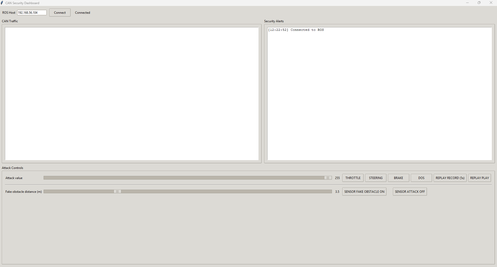

# Vehicle CAN Cybersecurity Testbed

A final-year cybersecurity project demonstrating CAN bus security risks, attack simulation, and basic intrusion detection using CARLA, ROS Noetic, Python, and PCAN-USB hardware.

> **Project focus:** This project was developed for academic and educational cybersecurity research in a controlled simulation/testbed environment.

---

## Overview

This project builds a virtual vehicle cybersecurity testbed where a simulated vehicle in CARLA is connected to a ROS-based control and monitoring environment. Vehicle control and status data are represented as CAN-style messages, allowing different CAN-layer attack scenarios to be demonstrated and monitored.

Under normal conditions, the vehicle follows expected driving behaviour in CARLA. During an active attack scenario, injected or replayed CAN messages can temporarily influence vehicle control, making the security impact visible in the simulation and dashboard.

The project was designed to show how insecure in-vehicle communication can affect vehicle behaviour and how simple intrusion detection logic can help identify suspicious CAN traffic.

---

## Key Features

- CARLA vehicle simulation environment
- ROS Noetic integration
- CAN bus communication using PCAN-USB hardware
- Python dashboard for monitoring vehicle state and CAN traffic
- CAN control messages for throttle, steering, and braking
- Attack demonstrations including injection, replay, fuzzing, and denial-of-service behaviour
- Basic IDS alerts for suspicious CAN activity
- Hybrid control model combining normal CARLA driving with CAN-based attack override
- Documentation for setup, troubleshooting, and demonstration

---

## Demo

### Screenshots

Add screenshots to the `images/` folder and update the names below if needed.

```markdown



```

### Video Demonstration

Add your video link here:

```markdown
[Watch the demo video](PASTE_VIDEO_LINK_HERE)
```

Recommended video content:

1. Start CARLA and ROS environment
2. Show the dashboard connected to ROS/CAN
3. Demonstrate normal vehicle behaviour
4. Trigger a CAN attack scenario
5. Show CAN traffic and IDS/security alert output
6. Explain what the attack demonstrates

---

## System Architecture

```text
+-------------------+        +-------------------+        +-------------------+
|   CARLA Simulator | <----> |      ROS Noetic   | <----> |   Python Dashboard|
|   Windows 11      |        |   Ubuntu 20.04    |        |   Monitoring/GUI  |
+-------------------+        +-------------------+        +-------------------+
                              |
                              |
                              v
                       +----------------+
                       |   CAN Bridge   |
                       |   PCAN-USB     |
                       +----------------+
                              |
                              v
                       +----------------+
                       |  CAN Traffic   |
                       |  IDS/Attacks   |
                       +----------------+
```

### Component Summary

| Component | Purpose |
|---|---|
| CARLA | Simulates the vehicle and driving environment |
| ROS Noetic | Handles communication between simulation, nodes, and dashboard |
| CAN Bridge | Converts vehicle control/status data into CAN-style messages |
| PCAN-USB | Provides physical CAN hardware interface for testing |
| Dashboard | Displays vehicle state, CAN messages, and attack controls |
| IDS Node | Monitors CAN traffic and raises alerts for suspicious behaviour |
| Attack Node | Demonstrates controlled CAN-layer attack scenarios |

---

## Technologies Used

- Python
- ROS Noetic
- CARLA 0.9.13
- Ubuntu 20.04
- Windows 11
- PCAN-USB
- SocketCAN
- Tkinter
- CAN bus message analysis
- Wireshark / candump / cansend

---

## CAN Message Design

The project uses CAN-style messages to represent vehicle control and status information.

### Control Messages

| CAN ID | Message | Description |
|---|---|---|
| `0x100` | Throttle Control | Controls throttle input |
| `0x101` | Steering Control | Controls steering input |
| `0x102` | Brake Control | Controls braking input |

### Status Messages

| CAN ID | Message | Description |
|---|---|---|
| `0x200` | Engine Status | Represents engine-related data |
| `0x203` | Transmission Status | Represents gear/speed-related data |
| `0x204` | Brake System Status | Represents brake-related data |

These messages were used to demonstrate how normal traffic can be monitored and how malicious or abnormal traffic can affect the simulated vehicle.

---

## Attack Scenarios

### 1. Throttle Injection

Injects throttle control messages to demonstrate how unauthorised CAN traffic could influence acceleration behaviour in a vulnerable system.

### 2. Brake Injection

Injects braking messages to demonstrate how control messages could interfere with normal driving behaviour.

### 3. Replay Attack

Replays previously captured CAN messages to show how valid but reused messages can still cause unsafe or unexpected behaviour.

### 4. Fuzzing

Sends abnormal or unexpected CAN values to test how the system responds to unusual input.

### 5. Denial of Service Behaviour

Generates high-rate CAN traffic to demonstrate how message flooding can affect monitoring and system reliability.

> These scenarios are demonstrated only in a controlled simulation and testbed environment.

---

## Intrusion Detection

A basic IDS component monitors CAN traffic for suspicious behaviour such as:

- unexpected control values
- high-frequency CAN messages
- repeated or replayed frames
- abnormal changes in throttle, steering, or braking
- traffic patterns that differ from normal driving behaviour

When suspicious activity is detected, alerts are displayed in the dashboard/security alert area.

---

## Repository Structure

```text
vehicle-can-cybersecurity-testbed/
│
├── README.md
├── docs/
│   ├── setup-guide.md
│   ├── attack-scenarios.md
│   ├── architecture.md
│   └── troubleshooting.md
│
├── images/
│   ├── dashboard.png
│   ├── carla-simulation.png
│   ├── can-traffic.png
│   └── system-architecture.png
│
├── videos/
│   └── demo-link.md
│
├── dashboard/
│   └── dashboard.py
│
├── ros_nodes/
│   ├── can_bridge.py
│   ├── ids_node.py
│   └── attack_node.py
│
├── launch/
│   └── complete_car_simulation.launch
│
├── requirements.txt
└── .gitignore
```

This structure can be adjusted depending on the final file names used in the project.

---

## Setup Overview

Detailed setup instructions are available in [`docs/setup-guide.md`](docs/setup-guide.md).

### Requirements

- Windows 11 host machine
- Ubuntu 20.04 environment
- ROS Noetic
- CARLA 0.9.13
- Python 3.7 for CARLA API compatibility
- PCAN-USB adapters
- CAN wiring with correct termination
- Required Python packages listed in `requirements.txt`

### Example Launch Steps

Start CARLA on Windows:

```powershell
CarlaUE4.exe /Game/Carla/Maps/Town01 -windowed -ResX=800 -ResY=600 -carla-server
```

Start ROS core on Ubuntu:

```bash
roscore
```

Launch the CARLA ROS bridge:

```bash
roslaunch carla_ros_bridge carla_ros_bridge.launch host:=<WINDOWS_IP> port:=2000 timeout:=10000
```

Launch the project nodes:

```bash
roslaunch car_nodes complete_car_simulation.launch debug:=true
```

Launch rosbridge for the dashboard:

```bash
roslaunch rosbridge_server rosbridge_websocket.launch
```

Run the dashboard:

```bash
python dashboard.py
```

> Replace placeholder IP addresses and file paths with the correct values for your environment.

---

## What I Learned

Through this project, I gained practical experience with:

- vehicle cybersecurity concepts
- CAN bus communication
- attack simulation in a controlled testbed
- ROS and CARLA integration
- Python-based dashboard development
- Linux and Windows networking troubleshooting
- physical CAN hardware setup using PCAN-USB
- intrusion detection logic for CAN traffic
- documenting and presenting a cybersecurity project

---

## Future Improvements

Possible future improvements include:

- improving IDS accuracy and reducing false positives
- adding more realistic replay and DoS scenarios
- improving dashboard visualisation
- adding automated logging and report generation
- expanding the CAN message model
- adding more detailed attack comparison results
- creating a GitHub Pages website for a cleaner project showcase

---

## Disclaimer

This project is intended for academic, educational, and defensive cybersecurity research only. All attack scenarios are designed for a controlled simulation and testbed environment. The project should not be used against real vehicles, real networks, or systems without permission.

---

## Author

**Marko Jovic**  
BSc Cyber Crime and IT Security  
SETU Carlow
